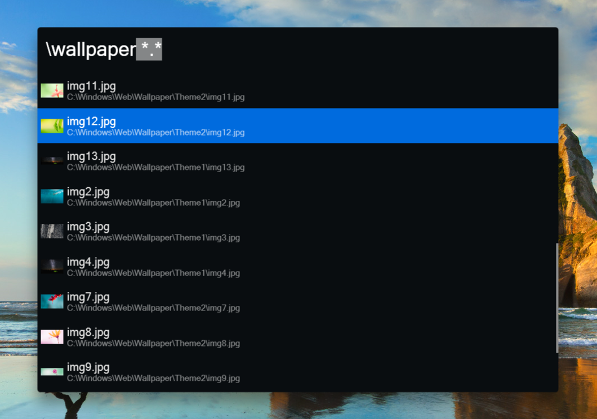

# myAlfredWoxTheme

Just another themes for [Wox](http://www.wox.one) which make it more like Alfred.

## How to use
* Download this project
* Go to Wox's data directory usually in `C:\Users\%UserName%\AppData\Local\Wox`, you'll find a folder that starts with `app-`
* Copy **xaml** files from this project's `Themes` folder into `Themes` folder under `app-`, replace `Base.xaml`
* Open Wox settings select one these themes

> P.S: AppData is a hidden folder in the system, if you can not find it, just press `Win + R` and input `%AppData%\..\Local\Wox`, you'll be there.

This is how it looks on my system:

